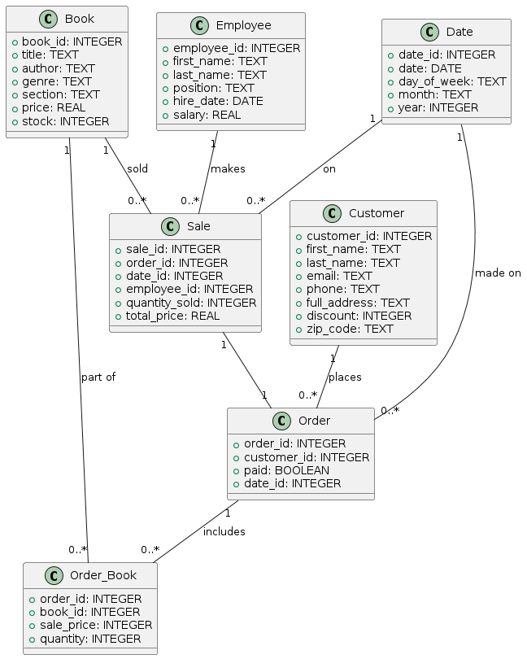
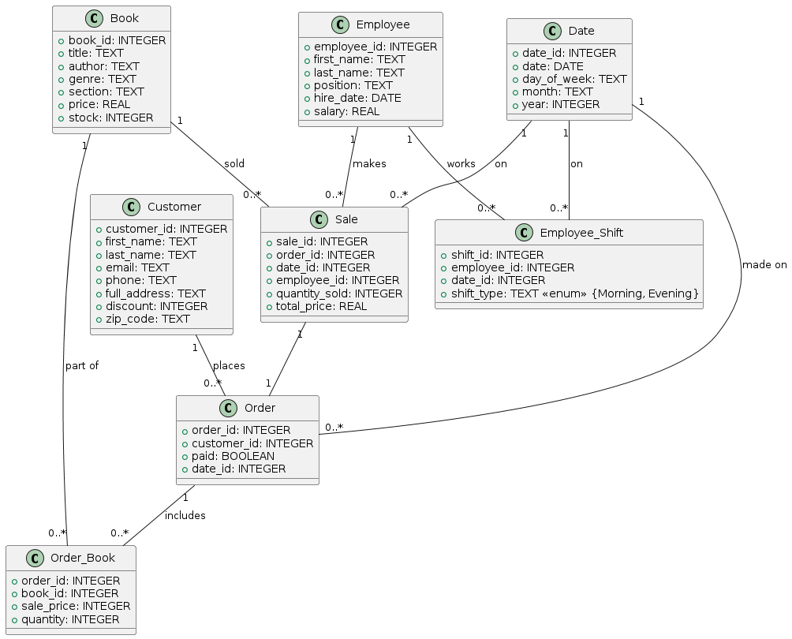

# Assignment 1: Design a Logical Model
Dmytro Bonislavskyi

## Question 1
Create a logical model for a small bookstore. 📚

At the minimum it should have employee, order, sales, customer, and book entities (tables). Determine sensible column and table design based on what you know about these concepts. Keep it simple, but work out sensible relationships to keep tables reasonably sized. Include a date table. There are several tools online you can use, I'd recommend [_Draw.io_](https://www.drawio.com/) or [_LucidChart_](https://www.lucidchart.com/pages/).

## Link to assignment image (logical model for a small bookstore): images\no-shifts.png:
	-  

## Question 2
We want to create employee shifts, splitting up the day into morning and evening. Add this to the ERD.

## Link to assignment image (logical model for a small bookstore with employee shifts): sql\02_assignments\images\with-shifts.png:
	-  

## Question 3
The store wants to keep customer addresses. Propose two architectures for the CUSTOMER_ADDRESS table, one that will retain changes, and another that will overwrite. Which is type 1, which is type 2?

_Hint, search type 1 vs type 2 slowly changing dimensions._

## Type 1 - Overwrites Changes
CREATE TABLE CUSTOMER_ADDRESS (
    customer_id INTEGER PRIMARY KEY,
    address_id INTEGER,
    full_address TEXT,
    city TEXT,
    province TEXT,
    zip_code TEXT,
    last_updated DATE
);

## Type 2 - Retains Changes
CREATE TABLE CUSTOMER_ADDRESS (
    address_id INTEGER PRIMARY KEY,
    customer_id INTEGER,
    full_address TEXT,
    city TEXT,
    province TEXT,
    zip_code TEXT,
    start_date DATE,
    end_date DATE,
    current_flag BOOLEAN
);

Bonus: Are there privacy implications to this, why or why not?

We didn`t made any masking or anonymizing, but, we separated client Names and Address to different tables, so we can apply access control policies to Address table to prevent unauthorized queries.
Also it would be nice to keep audit logs.

## Question 4
Review the AdventureWorks Schema [here](https://i.stack.imgur.com/LMu4W.gif)

Highlight at least two differences between it and your ERD. Would you change anything in yours?

## 1. 
AdventureWorks is organized into 6 distinct logical schemas, offering a foundation for implementing access control measures. This approach is beneficial not only for large databases but also for smaller ones, ensuring scalability as needs evolve over time.

## 2. 
In contrast to AdventureWorks, my bookstore database relies on simple and direct relationships connecting sales, customers, and employees. While AdventureWorks navigates through intricate relationships, my database prioritizes straightforward connections, enhancing clarity and ease of management.

# Criteria

[Assignment Rubric](./assignment_rubric.md)

# Submission Information

🚨 **Please review our [Assignment Submission Guide](https://github.com/UofT-DSI/onboarding/blob/main/onboarding_documents/submissions.md)** 🚨 for detailed instructions on how to format, branch, and submit your work. Following these guidelines is crucial for your submissions to be evaluated correctly.

### Submission Parameters:
* Submission Due Date: `June 1, 2024`
* The branch name for your repo should be: `model-design`
* What to submit for this assignment:
    * This markdown (design_a_logical_model.md) should be populated.
    * Two Entity-Relationship Diagrams (preferably in a pdf, jpeg, png format).
* What the pull request link should look like for this assignment: `https://github.com/<your_github_username>/sql/pull/<pr_id>`
    * Open a private window in your browser. Copy and paste the link to your pull request into the address bar. Make sure you can see your pull request properly. This helps the technical facilitator and learning support staff review your submission easily.

Checklist:
- [ ] Create a branch called `model-design`.
- [ ] Ensure that the repository is public.
- [ ] Review [the PR description guidelines](https://github.com/UofT-DSI/onboarding/blob/main/onboarding_documents/submissions.md#guidelines-for-pull-request-descriptions) and adhere to them.
- [ ] Verify that the link is accessible in a private browser window.

If you encounter any difficulties or have questions, please don't hesitate to reach out to our team via our Slack at `#cohort-3-help`. Our Technical Facilitators and Learning Support staff are here to help you navigate any challenges.
